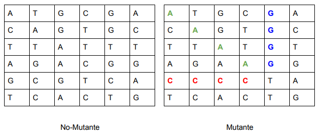
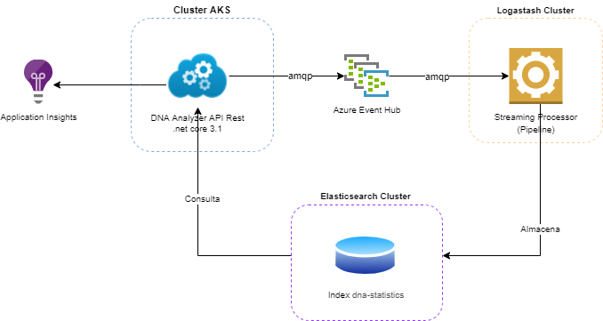
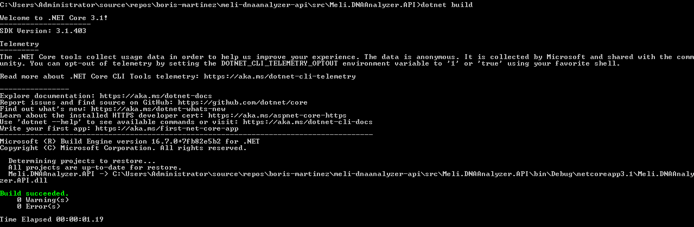
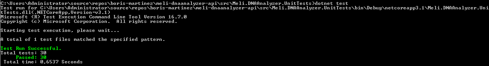
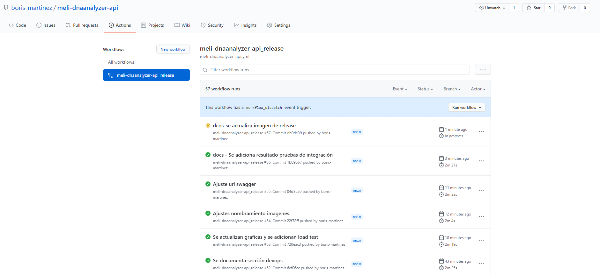

# DNA Analyzer
Magneto quiere reclutar la mayor cantidad de mutantes para poder luchar contra los X-Men. Te ha contratado a ti para que desarrolles un proyecto que detecte si un humano es mutante basándose en su secuencia de ADN. Para eso te ha pedido crear un programa con un método o función con la siguiente firma (En alguno de los siguiente lenguajes: Java / Golang / C-C++ / Javascript (node) / Python / Ruby):

 **boolean isMutant(String[] dna); // Ejemplo Java** 

En donde recibirás como parámetro un array de Strings que representan cada fila de una tabla de (NxN) con la secuencia del ADN. Las letras de los Strings solo pueden ser: (A,T,C,G), las cuales representa cada base nitrogenada del ADN. 




Sabrás si un humano es mutante, si encuentras **más de una secuencia de cuatro letras iguales**, de forma oblicua, horizontal o vertical. 

**Ejemplo (Caso mutante):**

 String[] dna = {"ATGCGA","CAGTGC","TTATGT","AGAAGG","CCCCTA","TCACTG"}; 

En este caso el llamado a la función isMutant(dna) devuelve "true".

**Desafíos:**

**Nivel 1:**
Programa (en cualquier lenguaje de programación) que cumpla con el método pedido por
Magneto.

**Nivel 2:**
Crear una API REST, hostear esa API en un cloud computing libre (Google App Engine,
Amazon AWS, etc), crear el servicio “/mutant/” en donde se pueda detectar si un humano es
mutante enviando la secuencia de ADN mediante un HTTP POST con un Json el cual tenga el
siguiente formato:

POST → /mutant/
{
"dna":["ATGCGA","CAGTGC","TTATGT","AGAAGG","CCCCTA","TCACTG"]
}

En caso de verificar un mutante, debería devolver un HTTP 200-OK, en caso contrario un
403-Forbidden

**Nivel 3:**
Anexar una base de datos, la cual guarde los ADN’s verificados con la API.
Solo 1 registro por ADN.
Exponer un servicio extra "/stats" que devuelva un Json con las estadísticas de las
verificaciones de ADN: {"count_mutant_dna":40, “count_human_dna:"100 "ratio:0.4}

Tener en cuenta que la API puede recibir fluctuaciones agresivas de tráfico (Entre 100 y 1
millón de peticiones por segundo).

Test-Automáticos, Code coverage > 80%.

## Build Status (GitHub Actions)


|      Image       |                            Status                            |
| :--------------: | :----------------------------------------------------------: |
| DNA Analyzer API |  |


# Architecture
### Architecture Drivers

A continuación se listan (el orden establece la prioridad) los atributos de calidad que debe soportar el sistema:

1. **Rendimiento**: Se requiere que tanto el proceso de análisis de DNA, como el de telemetría, sean lo mas eficiente posible en términos de cpu y memoria y genere las respuestas en el menor tiempo posible (300  ms en promedio).

   

2. **Escalabilidad**: El sistema debe soportar entre 100 y 1 millón de peticiones por segundo.

   

3. **Mantenibilidad**: Aunque este atributo no se menciona de forma explicita, todo software que se construye debe tener un buen índice de mantenibilidad con el fin de que otras personas puedan entenderlo fácilmente y puedan evolucionarlo de manera eficaz.

   

4. **Testeability**: El sistema debe poderse probar mediante casos de prueba automatizados y tener una cobertura mayor al 80%.

   

5. **Disponibilidad:** Aunque este atributo  no se menciona de forma explicita, actualmente todo sistema debe manejar un alto porcentaje de disponibilidad , ser resiliente y manejar una buena tolerancia a fallos.

   

De igual forma se plantean las siguientes *restricciones* y *suposiciones*:

1. El ambiente de despliegue es limitado y de bajo costo, por lo tanto los componentes tendrán restricciones de escalabilidad en escenarios de pruebas de carga.

   

2. El ambiente de despliegue es limitado y de bajo presupuesto, por lo tanto el API estará disponible en la siguiente ventana horaria: Lunes - Viernes entre 8am - 5pm.

   

3. Se  acepta consistencia eventual para el proceso de telemetría de las estadísticas de las verificaciones de ADN.

   

4. Por definición, no es posible calcular un ratio cuando alguno de los factores es cero. Por lo tanto cuando esto ocurra, el API omitirá este elemento del json de respuesta.

   

5. Al principio del enunciado se restringe la implementación del desarrollo a los siguientes lenguajes: Java / Golang / C-C++ / Javascript (node) / Python / Ruby). Sin embargo mas adelante se indica que puede ser desarrollado en cualquier otro lenguaje. Por lo tanto se opta por hacer la implementación en c#.

   

6. Se asume que dos o mas secuencias de 4 letras iguales de ADN se pueden solapar, siempre y cuando sean de direcciones diferentes. Este tipo de secuencias contarán para determinar si un humano es mutante o no.

   

7. Se asume que las pruebas unitarias relacionadas con el dominio fueron aprobadas por el dueño del producto. [Ver documento de pruebas unitarias](docs/CasosPruebas.xlsx) .

   

8. Se asume que la solicitud de almacenamiento del DNA es para fines estadísticos, telemetría o BAM (Business Activity Monitoring).


### Architecture Decision Records (ADR)

* [01 Desacoplar proceso de análisis y de telemetría](docs/adr/2021-04-16_1_Separación-analisisdna-telemetria.md)
* [02 Selección repositorio de información de telemetría](docs/adr/2021-04-16_2_Persistencia-estadisticas.md)
* [03 Selección streaming processor de eventos de telemetría](docs/adr/2021-04-16_3_Streaming-processor-telemetria.md)
* [04 Broker de mensajería](docs/adr/2021-04-16_4_Broker-mensajeria.md)
* [05 Clean Arquitecture](docs/adr/2021-04-16_5_Clean-arquitecture.md)
* [06 Implementación de principios SOLID, SLAP, DRY](docs/adr/2021-04-16_8_Principios-solid.md)
* [07 Estrategia eficiencia computacional algoritmo de analisis ADN](docs/adr/2021-04-16_6_Eficiencia-computacional.md)
* [08 Observabilidad](docs/adr/2021-04-16_7_Observabilidad.md)

### Vista de Despliegue



*Cluster AKS:* Un nodo tipo Standard_DS2_v2, 2 vCPUs, 7 GiB de memoria Ram. Se crean 5 replicas (POD) para balancear la carga.

*Cluster Logstach*: Un nodo tipo Standard DS1 v2, 1 vCPUs, 3.5 GiB de memoria Ram.

*Cluster Elasticsearch*: Dos nodos tipo Standard DS1 v2, 1 vCPUs, 3.5 GiB de memoria Ram. Se despliega pipeline de procesamiento descrito en el archivo [logstash.conf](deploy/logstash/logstash.conf).

# Devops
### Build and Tests

El DNA Analyzer API corre sobre [.NET Core 3.1](https://dotnet.microsoft.com/download) , por lo tanto asegurarse de tener instalado dicho framework en la maquina donde se va a compilar.  Para compilar y ejecutar las pruebas seguir las siguientes pasos:

1. Clonar el proyecto del repositorio de código fuente en cualquier carpeta de su maquina local:

```
git clone https://github.com/boris-martinez/meli-dnaanalyzer-api.git
```

2. Ingresar a la carpeta Meli.DNAAnalyzer.API:

```
cd meli-dnaanalyzer-api/src/Meli.DNAAnalyzer.API 
```

3. Realizar la compilación

```
dotnet build
```

4. Si el proceso de build se realizó correctamente, se debe mostrar el resultado de la siguiente manera:



5. Para ejecutar las pruebas unitarias, ingresar a la carpeta que contiene las pruebas unitarias: Meli.DNAAnalyzer.UnitTests

```
cd meli-dnaanalyzer-api/src/Meli.DNAAnalyzer.UnitTests
```

6. Ejecutar las pruebas unitarias

```
dotnet test
```

7. Si la ejecución de las pruebas unitarias se realizó correctamente, se debe mostrar el resultado de la siguiente manera:



8. Para ejecutar las pruebas de integración, primero se debe verificar que toda la infraestructura esté correctamente desplegada y operativa. En caso de que si, ingresar a la carpeta que contiene las pruebas de integración: Meli.DNAAnalyzer.IntegrationTests

```
cd meli-dnaanalyzer-api/src/Meli.DNAAnalyzer.IntegrationTests
```

9. Ejecutar las pruebas de integración con el mismo comando que se ejecutaron las pruebas unitarias. 

10. Ejecutar las pruebas de carga a través de [JMeter](https://jmeter.apache.org/) configurando el plan [DnaAnalyzer.jmx](src/Meli.DNAAnaluzer.LoadTests/DnaAnalyzer.jmx).


### Release

Se construyó una tubería de despliegue al AKS de pruebas, con el fin de realizar entrega continua al ambiente de pruebas en la medida que el API se iba construyendo. Esto ayudó a ser muy eficientes en el proceso de despliegue y validar muy rápidamente los cambios que se iban haciendo iterativamente. El workflow está descrito en el archivo [meli-dnaanalyzer-api.yml](.github/workflows/meli-dnaanalyzer-api.yml) y se resume a continuación:

1. Se construye imagen a partir del DockerFile.
2. Se envía imagen al ACR de pruebas desplegado en Azure.
3. Se crea namespace *mutant* en aks de pruebas.
4. Se crea pull secret en namespace *mutant* con el fin de poder conectarse al ACR y obtener la imagen.
5. Se crea deployment y service en aks de prueba mediante los archivos [deployment.yml](deploy/k8s/deployment.yml) y  [service.yml](deploy/k8s/service.yml).



# Access Endpoint

*Health Check Enpoint:* http://52.151.201.4/health

*Open Api Endpoint*: http://52.151.201.4/index.html