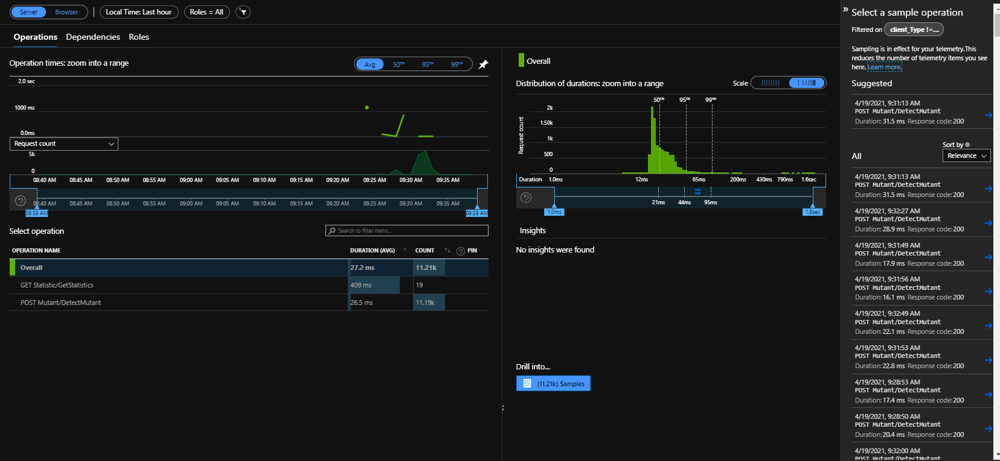
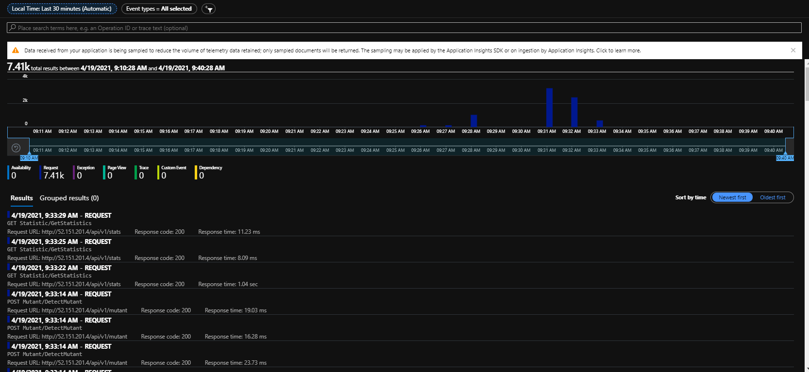

# Architecture Decision Record (ADR)

This is the template in [Documenting architecture decisions - Michael Nygard](http://thinkrelevance.com/blog/2011/11/15/documenting-architecture-decisions)

* **Author**: Boris Martinez.

* **Title**: Estrategia de observavilidad

* **Status**: accepted.

* **Context**: Lo que no se puede medir, no se puede mejorar. Adicional, se requiere contar con mecanismo que permita facilitar los diagnosticos en escenarios de fallo.

* **Decision**: Se selecciona Azure Application Insight como herramienta de observabilidad. Application Insight es una herramienta de observablidad y monitoreo administrada por Azure, mediante la cual una aplicación puede reportar toda la telemetría de ejecución, y logs de errores. Su costo varia en función de la cantidad de datos ingestados.  A continuación un ejemplo de como se presentan las métricas para el analizador de DNA:

  

  

  

  

* **Consequences**: (1) Monitoreabilidad del sistema. (2) Configuración Alertas errores, (3) Facilidad en el diagnostico de errores, (4) Mejoramiento continuo de los componentes en función de las metricas arrojadas.

